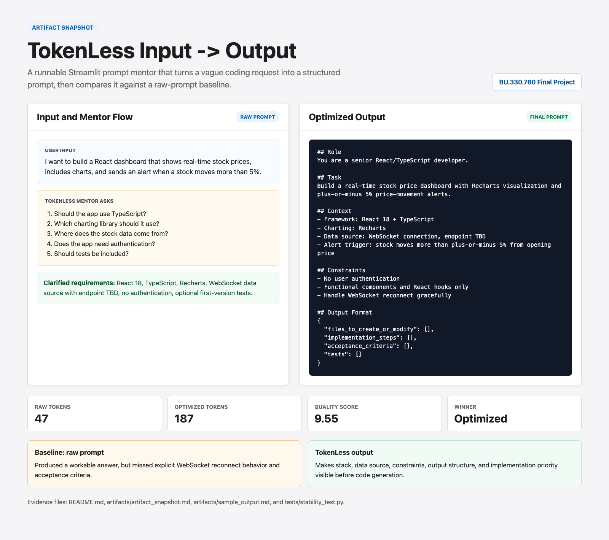
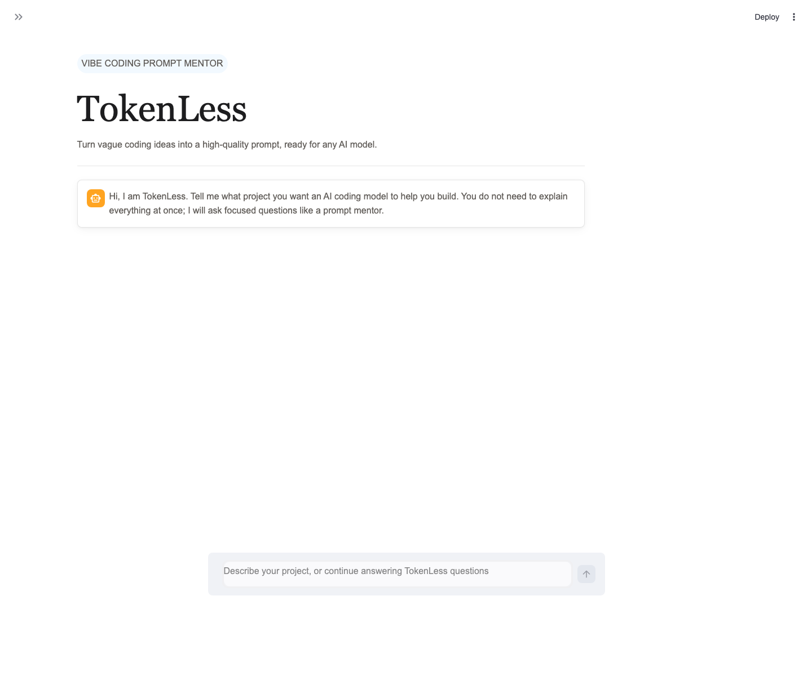

# TokenLess Artifact Snapshot

This file is the concise artifact snapshot for the final project submission. It shows what TokenLess does without requiring the grader to run a live demo first.

## What the Artifact Shows

TokenLess turns an underspecified software-development request into a structured prompt that a coding model can use more reliably. The snapshot covers:

- A screenshot that shows the raw input, mentor flow, optimized output, metrics, and baseline comparison
- A realistic raw user input
- The mentor clarification path
- The final optimized prompt
- Evaluation metrics against the raw-prompt baseline
- A known failure case where the system correctly refuses to over-polish an underspecified prompt

## Input/Output Screenshot



This is the primary artifact screenshot for the final submission because it shows both the input and the output in one concise view.

## Runnable App Screenshot



## Snapshot Input

```text
I want to build a React dashboard that shows real-time stock prices,
includes charts, and sends an alert when a stock moves more than 5%.
```

## Mentor Clarification Summary

TokenLess asks focused follow-up questions before optimization:

1. Should the app use TypeScript?
2. Which charting library should it use?
3. Where does the stock data come from?
4. Does the app need authentication?
5. Should tests be included?

The clarified requirements are React 18, TypeScript, Recharts, WebSocket data source with endpoint TBD, no authentication, and optional first-version tests.

## Optimized Output Snapshot

~~~markdown
## Role
You are a senior React/TypeScript developer. Your expertise: real-time data dashboards, financial UI components.

## Task
Build a real-time stock price dashboard with Recharts visualization and plus-or-minus 5% price-movement alerts.

## Context
- Framework: React 18 + TypeScript
- Charting: Recharts
- Data source: WebSocket connection (endpoint TBD; use a placeholder URL)
- Alert trigger: any stock moves more than plus-or-minus 5% from its opening price

## Constraints
- No user authentication
- Functional components and React hooks only
- Handle WebSocket reconnect gracefully on disconnect

## Output Format

```json
{
  "files_to_create_or_modify": [],
  "implementation_steps": [],
  "acceptance_criteria": [],
  "tests": []
}
```

## Reminder
Implement the WebSocket data feed and the alert logic first; the Recharts component is secondary.
~~~

## Metrics Snapshot

| Metric | Value |
|---|---|
| Raw prompt tokens | 47 |
| Optimized prompt tokens | 187 |
| Pipeline token cost | about 2,591 tokens |
| GPT-4o judge verdict | tie |
| Gemini judge verdict | optimized |
| Final winner | optimized |
| Overall quality score | 9.55 / 10 |

## Baseline Comparison

The raw prompt baseline produced a workable answer but missed important implementation constraints, especially WebSocket reconnection behavior and explicit acceptance criteria. The optimized prompt made those requirements visible and testable.

## Failure Snapshot

Raw prompt:

```text
Write a function
```

Result: the system blocks the optimized output because the prompt is too underspecified. This is intentional. The quality gate prevents TokenLess from producing a polished-looking prompt when the user's intent is not recoverable.

## Related Evidence

- `artifacts/sample_output.md` contains the same walkthrough with more detail.
- `README.md` contains setup, usage, evaluation, limitations, and the main artifact snapshot section.
- `tests/stability_test.py` validates the chat mentor, token ledger, ROI report, and final prompt display path offline.
